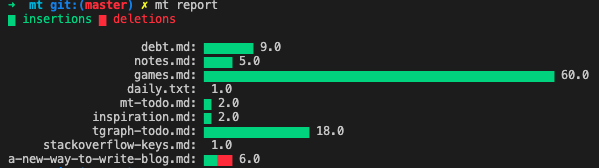

# MT - My thoughts

Personal note taking tools in the terminal

## Build

```zsh
go build .
```

## Install

```zsh
go install github.com/daoleno/mt
```

## Usage

```
Rocord all my thoughts

Usage:
  mt [command]

Available Commands:
  cat         View a thought
  clean       Clean all thoughts
  completion  Generates bash/zsh completion scripts
  decrypt     Decrypt all thoughts
  remove      Remove a thought
  encrypt     Encrypt all thoughts
  help        Help about any command
  list        List all thoughts
  open        Open a thought
  rename      Rename a thought
  render      Render all markdown to beautiful html
  report      Report
  web         Server static html page

Flags:
  -h, --help   help for mt

Use "mt [command] --help" for more information about a command.
```

## Example

Show writing report

> Graph



> Raw

```sh
➜  mt git:(master) ✗ mt report --raw
9       0       a-new-way-to-write-blog.md
5       0       daily.txt
60      0       debt.md
1       0       games.md
2       0       inspiration.md
2       0       mt-todo.md
18      0       notes.md
1       0       stackoverflow-keys.md
3       3       tgraph-todo.md
 9 files changed, 101 insertions(+), 3 deletions(-)
```

## Completion

### Zsh

Generate completion script

```sh
mt completion
```

Put somewhere in your `$fpath` named `_mt`

```
# example path
/usr/local/share/zsh/site-functions/_mt
```
